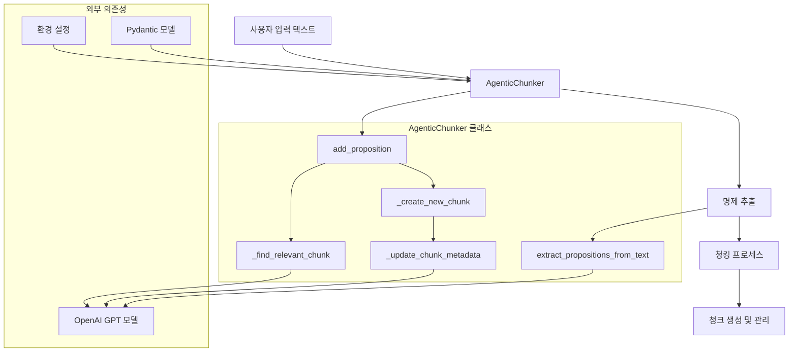
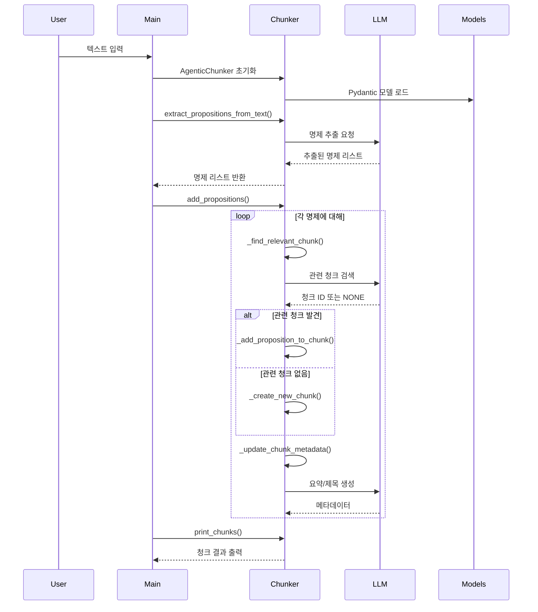
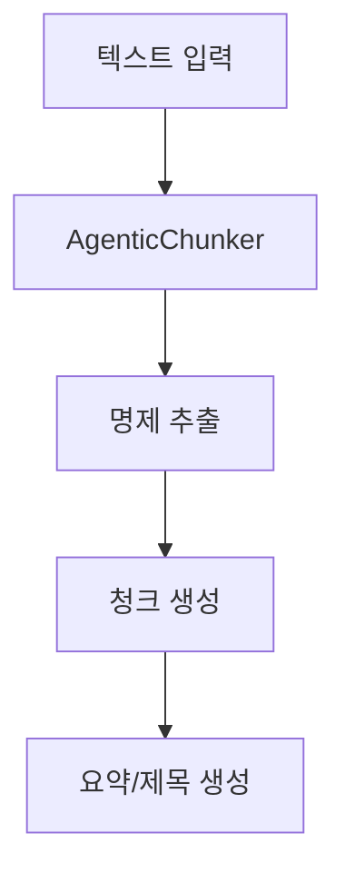
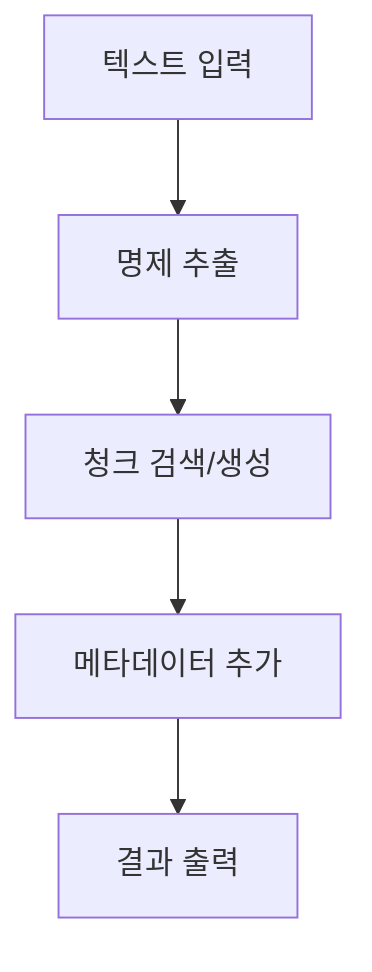

# Agentic Chunking

LangChain을 활용한 지능형 텍스트 청킹 시스템

[](https://www.python.org/)
[](https://www.langchain.com/)

## 개요

**Agentic Chunking**은 텍스트를 의미적 단위로 분할하는 지능형 시스템입니다. 기존의 단순한 길이 기반 청킹과 달리, LLM을 활용하여 텍스트의 의미적 구조를 분석하고 관련 있는 내용들을 그룹화합니다.

## 시스템 아키텍처

### 전체 시스템 구성도



### 데이터 흐름



## 코드 설명

### AgenticChunker 클래스
텍스트를 의미있는 단위로 분할하는 메인 클래스

- `extract_propositions_from_text()` - 텍스트를 명제로 분해
- `add_propositions()` - 명제들을 청크로 그룹화
- `print_chunks()` - 결과 출력

### 데이터 모델
Pydantic을 사용한 구조화된 데이터

- `ChunkID` - 청크 식별자
- `ChunkSummary` - 요약 텍스트
- `ChunkTitle` - 청크 제목
- `PropositionList` - 명제 리스트

## 핵심 다이어그램

### 시스템 구조도


### 작업 흐름도


## 🚀 설치 및 설정

### 1. 환경 설정

```bash
# 가상환경 생성 (선택사항)
python -m venv agentic_chunking_env
source agentic_chunking_env/bin/activate  # Linux/Mac
# 또는
agentic_chunking_env\Scripts\activate     # Windows

# 의존성 설치
pip install -r requirements.txt
```

### 2. OpenAI API 키 설정

```bash
export OPENAI_API_KEY="your-openai-api-key-here"
```

또는 `.env` 파일 생성:
```
OPENAI_API_KEY=your-openai-api-key-here
```

## 사용법

```python
from agentic_chunker import AgenticChunker

# 1. 초기화
chunker = AgenticChunker()

# 2. 텍스트에서 명제 추출
text = "여기에 긴 텍스트 입력..."
propositions = chunker.extract_propositions_from_text(text)

# 3. 청킹 실행
chunker.add_propositions(propositions)

# 4. 결과 출력
chunker.print_chunks()
```

### 실행하기

```bash
python main.py
```

## 설정

API 키 설정:
```bash
export OPENAI_API_KEY="your-key-here"
```

또는 `.env` 파일 생성

## 파일 구조

- `agentic_chunker.py` - 메인 청킹 클래스
- `config.py` - 설정 파일
- `main.py` - 실행 파일
- `models.py` - 데이터 모델
- `requirements.txt` - 의존성

## 라이선스

MIT License
