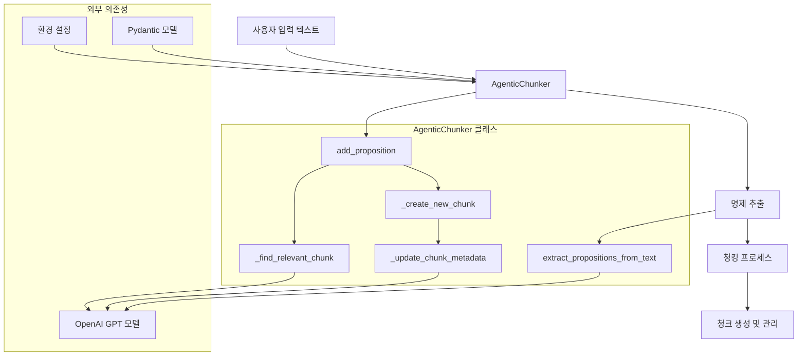
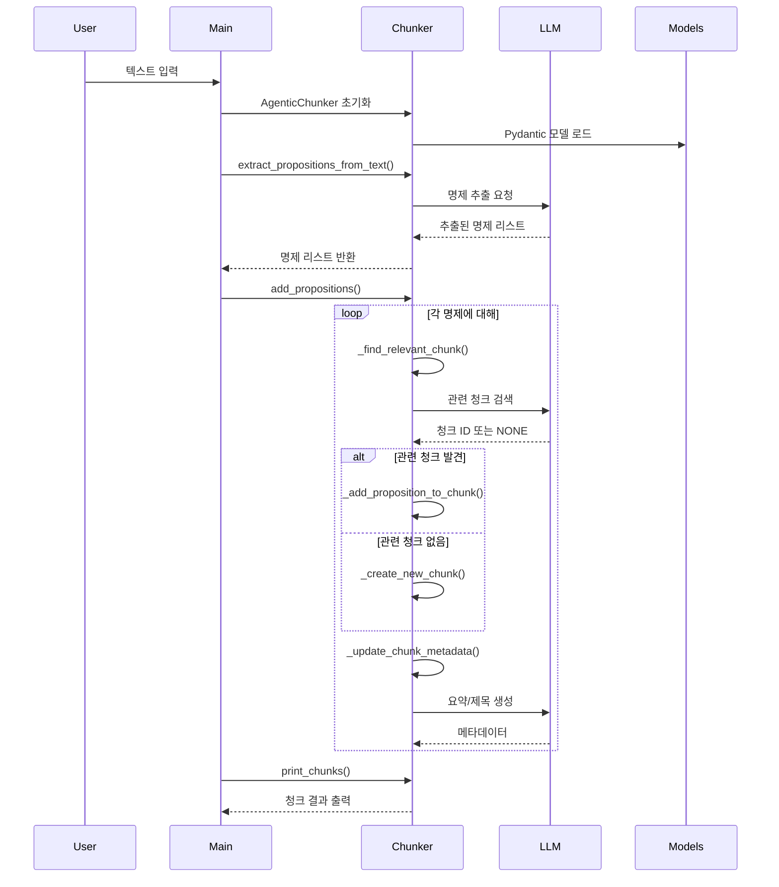
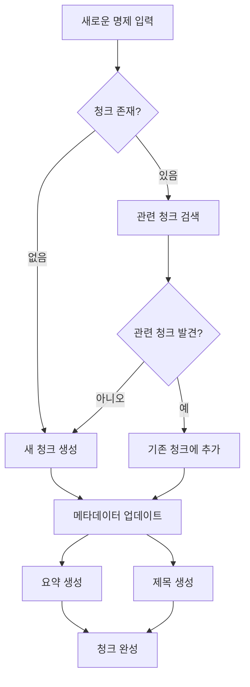
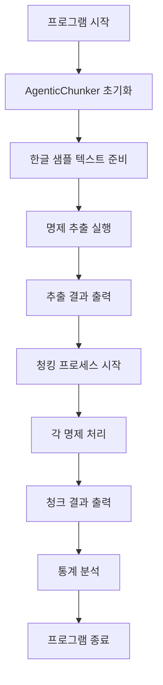
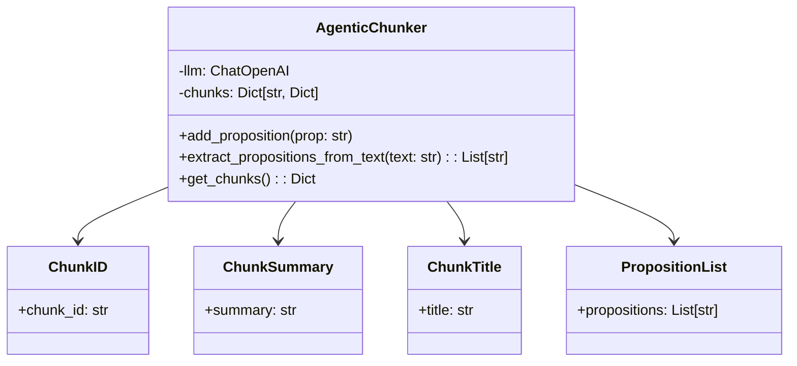
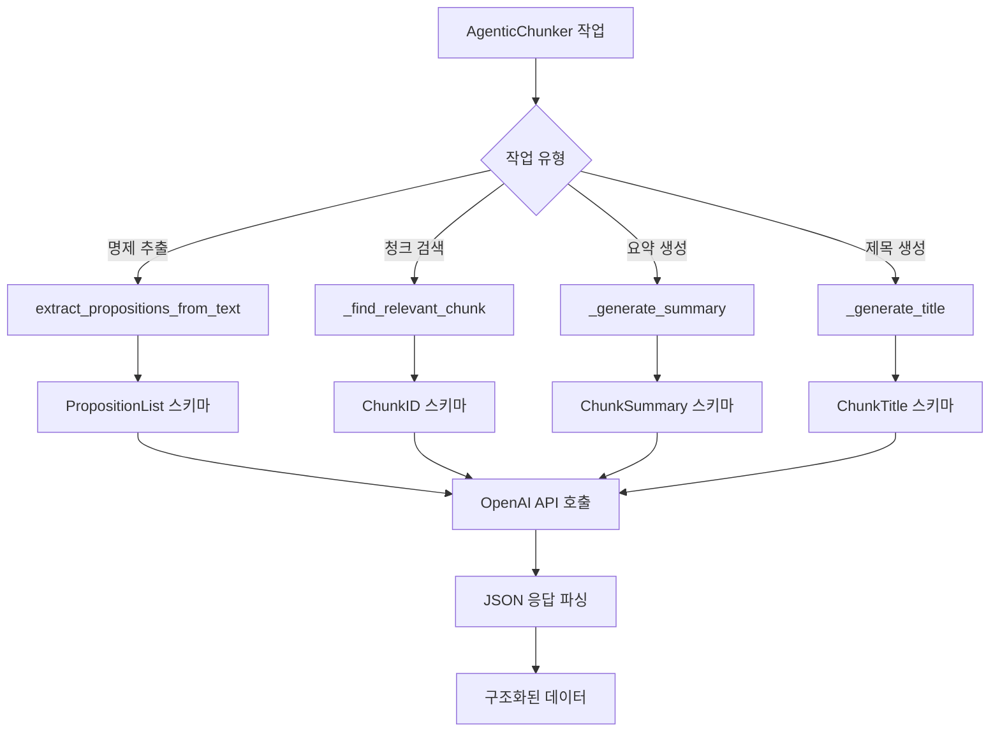
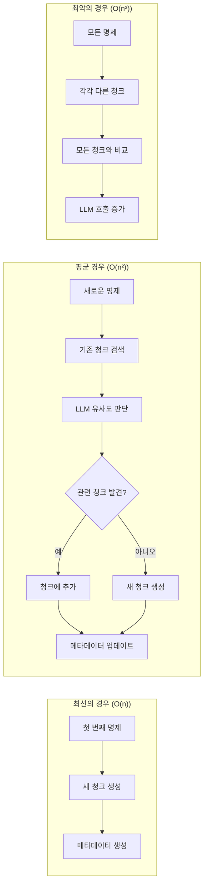
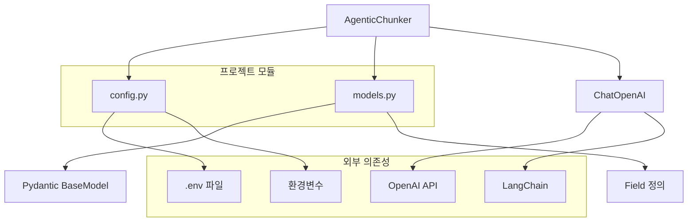

# Agentic Chunking

LangChain을 활용한 지능형 텍스트 청킹 시스템

[](https://www.python.org/)
[](https://www.langchain.com/)

## 개요

**Agentic Chunking**은 텍스트를 의미적 단위로 분할하는 지능형 시스템입니다. 기존의 단순한 길이 기반 청킹과 달리, LLM을 활용하여 텍스트의 의미적 구조를 분석하고 관련 있는 내용들을 그룹화합니다.

## 시스템 아키텍처

### 전체 시스템 구성도



### 데이터 흐름



## 코드 분석

### 1. AgenticChunker 클래스 (`agentic_chunker.py`)

#### 클래스 구조 및 주요 메서드

```python
class AgenticChunker:
    def __init__(self, model_name: str = config.DEFAULT_MODEL)
    def add_propositions(self, propositions: List[str]) -> None
    def add_proposition(self, proposition: str) -> None
    def get_chunks(self) -> Dict[str, Dict[str, Any]]
    def print_chunks(self) -> None
    def extract_propositions_from_text(self, text: str) -> List[str]
```

#### 핵심 알고리즘 흐름도



#### 주요 기능 상세

##### 명제 추출 기능
- **입력**: 원본 텍스트
- **처리**: LLM을 활용한 의미적 명제 단위 분해
- **출력**: 의미있는 명제들의 리스트

##### 청크 관리 기능
- **청크 생성**: UUID 기반 고유 ID 할당
- **청크 검색**: 의미적 유사도 기반 기존 청크 탐색
- **청크 업데이트**: 요약 및 제목 자동 생성

##### 메타데이터 관리
- **요약 생성**: 청크 내용의 핵심 아이디어 추출
- **제목 생성**: 청크를 대표하는 간결한 제목 부여

### 2. 설정 관리 (`config.py`)

#### 설정 구조

```python
# 환경변수 로드
OPENAI_API_KEY = os.getenv("OPENAI_API_KEY")

# 모델 설정
DEFAULT_MODEL = "gpt-4o-mini"
TEMPERATURE = 0.1

# 청크 설정
MAX_CHUNK_SIZE = 1000
MIN_CHUNK_SIZE = 100
```

#### 환경 설정 다이어그램

```mermaid
graph LR
    A[.env 파일] --> B[load_dotenv()]
    B --> C[환경변수 로드]
    C --> D[API 키 검증]
    D --> E[모델 초기화]

    F[config.py] --> G[기본값 설정]
    G --> H[모델 파라미터]
    G --> I[청크 제한값]

    E --> J[AgenticChunker]
    H --> J
    I --> J
```

### 3. 메인 실행 파일 (`main.py`)

#### 실행 흐름도



#### 주요 처리 단계

1. **초기화 단계**: OpenAI API 연결 및 모델 설정
2. **명제 추출 단계**: 텍스트를 의미있는 단위로 분해
3. **청킹 단계**: 관련 있는 명제들을 그룹화
4. **결과 출력**: 청크별 요약 및 통계 제공

### 4. 데이터 모델 (`models.py`)

#### Pydantic 모델 구조

```python
class ChunkID(BaseModel):
    chunk_id: str = Field(description="관련 청크의 ID, 관련성이 없으면 'NONE'")

class ChunkSummary(BaseModel):
    summary: str = Field(description="청크 내용의 간결한 요약")

class ChunkTitle(BaseModel):
    title: str = Field(description="청크 내용을 나타내는 간결한 제목")

class PropositionList(BaseModel):
    propositions: List[str] = Field(description="텍스트에서 추출된 명제들의 리스트")
```

#### 모델 관계도



## 기술적 세부사항

### API 호출 패턴 분석

#### 주요 LLM 호출 유형



#### 각 호출의 목적과 특징

| 호출 유형 | 목적 | 입력 크기 | 출력 형식 | 특징 |
|---------|------|----------|----------|------|
| 명제 추출 | 텍스트 → 의미적 단위 분해 | 전체 텍스트 | List[str] | 구조적 분해 |
| 청크 검색 | 새 명제 → 기존 청크 매칭 | 명제 + 청크 정보 | str (청크 ID) | 유사도 판단 |
| 요약 생성 | 청크 내용 → 핵심 요약 | 청크 내 명제들 | str | 1-2문장 요약 |
| 제목 생성 | 청크 내용 → 대표 제목 | 청크 내 명제들 | str | 3-5단어 제목 |

### 알고리즘 복잡도 및 성능 특성

#### 시간 복잡도 분석



#### 메모리 사용량

- **청크 저장**: `Dict[str, Dict[str, Any]]` 구조
- **메타데이터**: 각 청크당 요약(100-200자) + 제목(20-50자)
- **임시 데이터**: LLM 호출 시 프롬프트 생성 및 응답 파싱

### 에러 처리 및 견고성

#### 예외 처리 구조

```python
try:
    result = structured_llm.invoke(prompt)
    return result.chunk_id
except Exception as e:
    print(f"청크 찾기 중 오류 발생: {e}")
    return None
```

#### 폴백 메커니즘

1. **LLM 호출 실패 시**: `None` 반환 또는 기본값 사용
2. **API 제한 초과 시**: 재시도 로직 구현 가능
3. **네트워크 오류 시**: 로컬 캐싱 또는 기본 알고리즘 사용

### 확장성 및 모듈화

#### 클래스 의존성 구조



## 🚀 설치 및 설정

### 1. 환경 설정

```bash
# 가상환경 생성 (선택사항)
python -m venv agentic_chunking_env
source agentic_chunking_env/bin/activate  # Linux/Mac
# 또는
agentic_chunking_env\Scripts\activate     # Windows

# 의존성 설치
pip install -r requirements.txt
```

### 2. OpenAI API 키 설정

```bash
export OPENAI_API_KEY="your-openai-api-key-here"
```

또는 `.env` 파일 생성:
```
OPENAI_API_KEY=your-openai-api-key-here
```

## 사용법

### 기본 사용법

#### 1. AgenticChunker 초기화

```python
from agentic_chunker import AgenticChunker
import config

# 기본 설정으로 초기화 (config.py의 설정 사용)
chunker = AgenticChunker()

# 또는 커스텀 모델 지정
chunker = AgenticChunker(model_name="gpt-4o")
```

#### 2. 텍스트에서 명제 추출

```python
# 긴 텍스트를 의미있는 명제로 분해
text = """
인공지능은 현대 사회의 핵심 기술로 자리 잡았습니다.
머신러닝 알고리즘은 데이터를 분석하여 패턴을 찾아냅니다.
딥러닝은 신경망을 활용한 복잡한 문제 해결에 사용됩니다.
"""

propositions = chunker.extract_propositions_from_text(text)
print(f"추출된 명제 수: {len(propositions)}")

for i, prop in enumerate(propositions, 1):
    print(f"{i}. {prop}")
```

#### 3. 청킹 실행

```python
# 추출된 명제들을 청크로 그룹화
chunker.add_propositions(propositions)

# 또는 단일 명제 추가
chunker.add_proposition("새로운 기술이 등장했습니다.")
```

#### 4. 결과 확인

```python
# 청크 결과 출력
chunker.print_chunks()

# 청크 데이터 가져오기
chunks = chunker.get_chunks()
print(f"총 청크 수: {len(chunks)}")

for chunk_id, chunk_data in chunks.items():
    print(f"\n청크 ID: {chunk_id}")
    print(f"제목: {chunk_data['title']}")
    print(f"요약: {chunk_data['summary']}")
    print(f"명제 수: {len(chunk_data['propositions'])}")
```

### 테스트 실행

#### 샘플 실행

프로젝트에 포함된 테스트를 실행해보세요:

```bash
python main.py
```

실행 결과 예시:
```
🚀 Agentic Chunking Test Started

📝 한글 텍스트를 이용한 Agentic Chunking 테스트

🔍 한글 텍스트에서 명제 추출 중...
📋 추출된 명제 개수: 25
   1. 인공지능은 현재 우리 사회의 모든 분야에서 혁신을 이끌고 있습니다.
   2. 머신러닝 알고리즘은 대량의 데이터를 처리하고 인간이 놓칠 수 있는 패턴을 찾아냅니다.
   ...

🔄 추출된 명제들을 청크로 분류 중...
🆕 Created new chunk (a1b2c3d4): 인공지능 기술
✅ Found relevant chunk (a1b2c3d4), adding proposition
...

📊 Total chunks created: 6
================================================================================

🏷️ Chunk ID: a1b2c3d4
📝 Title: 인공지능 기술 발전
📄 Summary: 인공지능과 머신러닝 기술의 발전과 응용 분야에 대한 설명
📋 Propositions (8):
   1. 인공지능은 현재 우리 사회의 모든 분야에서 혁신을 이끌고 있습니다.
   2. 머신러닝 알고리즘은 대량의 데이터를 처리하고 인간이 놓칠 수 있는 패턴을 찾아냅니다.
   ...

🔍 청킹 결과 분석
================================================================================
📊 전체 통계:
   • 총 청크 수: 6개
   • 총 명제 수: 25개
   • 평균 청크당 명제 수: 4.2개
```

## 커스터마이징 및 확장

### 모델 설정 변경

```python
# 다른 OpenAI 모델 사용
chunker = AgenticChunker(model_name="gpt-4")

# 또는 gpt-3.5-turbo 사용 (function calling 지원)
chunker = AgenticChunker(model_name="gpt-3.5-turbo")
```

### 환경 설정

`.env` 파일을 생성하여 API 키를 설정하세요:

```env
OPENAI_API_KEY=your-openai-api-key-here
```

### 에러 처리 및 디버깅

```python
# 상세 로깅 활성화
import logging
logging.basicConfig(level=logging.INFO)

# 또는 특정 모듈만 로깅
logger = logging.getLogger("agentic_chunker")
logger.setLevel(logging.DEBUG)
```

## 프로젝트 구조

```
agentic_chunking/
├── agentic_chunker.py          # 메인 AgenticChunker 클래스
├── config.py                   # 설정 및 환경변수 관리
├── main.py                     # 실행 파일 (테스트 포함)
├── models.py                   # Pydantic 데이터 모델
├── requirements.txt            # Python 의존성 패키지
├── README.md                   # 프로젝트 문서
├── .gitignore                  # Git 무시 파일 목록
└── agentic_chunking_env/       # Python 가상환경 (무시됨)
```

### 파일별 역할

| 파일 | 역할 | 주요 기능 |
|------|------|----------|
| `agentic_chunker.py` | 핵심 청킹 로직 | AgenticChunker 클래스, LLM 연동, 청크 관리 |
| `config.py` | 환경 설정 | OpenAI API 키, 모델 설정, 기본 파라미터 |
| `main.py` | 실행 및 테스트 | 샘플 실행, 결과 출력, 통계 분석 |
| `models.py` | 데이터 모델 | Pydantic 스키마 정의 (ChunkID, Summary 등) |
| `requirements.txt` | 의존성 관리 | 필요한 Python 패키지 목록 |

## 주요 특징

### 1. 의미 기반 청킹
- LLM을 활용한 텍스트의 의미적 분석
- 관련 있는 내용들을 자동으로 그룹화
- 동적 청크 생성 및 관리

### 2. 구조화된 출력
- 각 청크에 제목과 요약 자동 생성
- UUID 기반 고유 식별자 부여
- 상세한 메타데이터 제공

### 3. 유연한 API
- 텍스트 직접 입력 또는 명제 리스트 입력 지원
- 실시간 청크 추가 및 업데이트
- 다양한 출력 형식 지원

## 제한사항 및 고려사항

### 현재 구현의 한계
1. **API 의존성**: OpenAI API 키 필요
2. **언어 제한**: 주로 한국어 텍스트 최적화
3. **토큰 비용**: 각 청킹 작업마다 LLM 호출 발생

### 성능 고려사항
- **처리 속도**: LLM 호출로 인한 지연 시간
- **비용 효율성**: 토큰 사용량에 따른 API 비용
- **메모리 사용**: 청크 데이터 누적 저장

### 개선 가능 방향
- 로컬 LLM 모델 지원 추가
- 캐싱 메커니즘 구현
- 배치 처리 기능 추가

## 라이선스

이 프로젝트는 MIT 라이선스 하에 배포됩니다.
