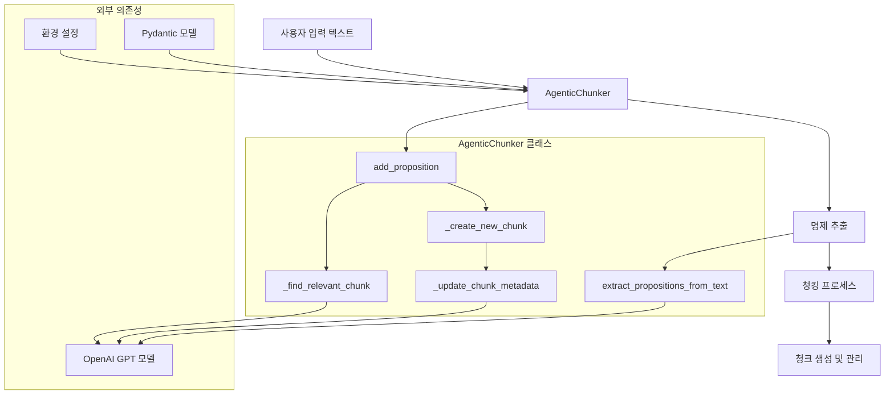
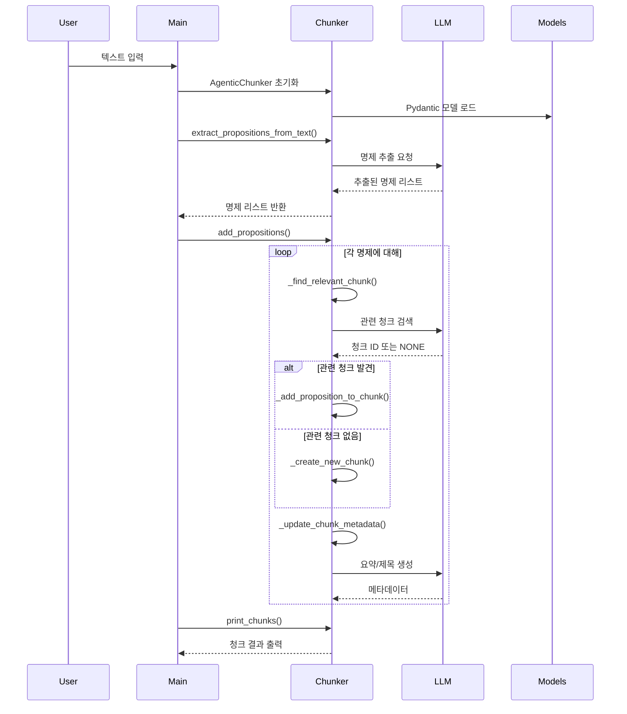
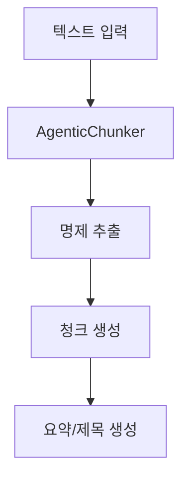
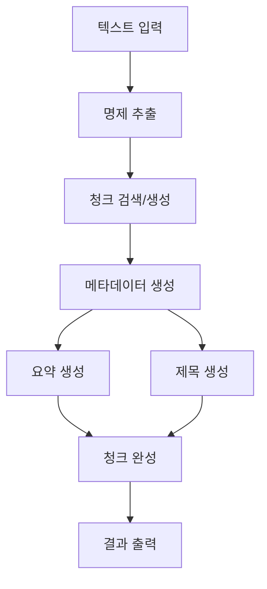

# Agentic Chunking

LangChain을 활용한 지능형 텍스트 청킹 시스템

[](https://www.python.org/)
[](https://www.langchain.com/)

## 개요

**Agentic Chunking**은 텍스트를 의미적 단위로 분할하는 지능형 시스템입니다. 기존의 단순한 길이 기반 청킹과 달리, LLM을 활용하여 텍스트의 의미적 구조를 분석하고 관련 있는 내용들을 그룹화합니다.

## 시스템 아키텍처

### 전체 시스템 구성도



### 데이터 흐름



## 코드 설명

### AgenticChunker 클래스
텍스트를 의미있는 단위로 분할하는 메인 클래스

- `extract_propositions_from_text()` - 텍스트를 명제로 분해
- `add_propositions()` - 명제들을 청크로 그룹화
- `print_chunks()` - 결과 출력

### 데이터 모델
Pydantic을 사용한 구조화된 데이터

- `ChunkID` - 청크 식별자
- `ChunkSummary` - 요약 텍스트
- `ChunkTitle` - 청크 제목
- `PropositionList` - 명제 리스트

## 핵심 다이어그램

### 시스템 구조도


### 작업 흐름도


### 메타데이터 생성 상세 과정
```mermaid
sequenceDiagram
    participant Chunk as 청크
    participant Update as _update_chunk_metadata()
    participant LLM as OpenAI GPT
    participant Summary as 요약 결과
    participant Title as 제목 결과

    Chunk->>Update: 청크 데이터 전달
    Update->>Update: 명제 리스트 결합
    Update->>LLM: 요약 생성 요청
    LLM->>Summary: 요약 텍스트 반환
    Update->>Chunk: 요약 저장

    Update->>LLM: 제목 생성 요청
    LLM->>Title: 제목 텍스트 반환
    Update->>Chunk: 제목 저장

    Update->>Chunk: 메타데이터 완성
```

### 메타데이터 생성 표

| 단계 | 메서드 | 입력 | LLM 프롬프트 | 출력 | 특징 |
|------|--------|------|--------------|------|------|
| 1 | `_update_chunk_metadata()` | 청크의 명제 리스트 | - | - | 메타데이터 생성 트리거 |
| 2 | `_generate_summary()` | 결합된 명제 텍스트 | "다음 텍스트의 핵심 내용을 간결하게 요약해주세요" | 1-2문장 요약 | 핵심 아이디어 추출 |
| 3 | `_generate_title()` | 결합된 명제 텍스트 | "다음 텍스트의 내용을 나타내는 간결한 제목을 생성해주세요" | 3-5단어 제목 | 대표 제목 생성 |

### 요약 생성 상세

| 항목 | 설명 | 예시 |
|------|------|------|
| **입력** | 청크 내 모든 명제 결합 | "인공지능은 혁신을... 머신러닝은 데이터를..." |
| **LLM 역할** | 텍스트 분석 전문가 | 요약 생성 요청 |
| **출력 형식** | 1-2문장 요약 | "인공지능은 머신러닝과 딥러닝을 통해..." |
| **목적** | 청크 내용의 핵심 포착 | 내용 이해 지원 |

### 제목 생성 상세

| 항목 | 설명 | 예시 |
|------|------|------|
| **입력** | 청크 내 모든 명제 결합 | 동일한 텍스트 |
| **LLM 역할** | 제목 생성 전문가 | 간결한 제목 요청 |
| **출력 형식** | 3-5단어 제목 | "인공지능 핵심 기술" |
| **목적** | 청크의 대표적 식별 | 빠른 내용 파악 |

### LLM 프롬프트 상세

| 유형 | 프롬프트 템플릿 | 응답 형식 | 특징 |
|------|----------------|----------|------|
| **요약 생성** | "다음 텍스트의 핵심 내용을 간결하게 요약해주세요...<br>- 1-2문장으로 핵심 내용을 요약하세요<br>- 주요 개념과 아이디어를 포함하세요" | JSON: `{"summary": "요약 텍스트"}` | Pydantic 스키마 사용 |
| **제목 생성** | "다음 텍스트의 내용을 나타내는 간결한 제목을 생성해주세요...<br>- 3-5단어로 간결하게 작성하세요<br>- 텍스트의 주요 주제를 반영하세요" | JSON: `{"title": "제목 텍스트"}` | 대표성 강조 |

### 메타데이터 활용 예시

```python
# 생성된 청크의 메타데이터 구조
chunk = {
    'propositions': ['명제1', '명제2', '명제3'],  # 원본 명제들
    'summary': '청크 내용의 핵심 요약 텍스트',    # LLM 생성 요약
    'title': '청크를 대표하는 간결한 제목'        # LLM 생성 제목
}

# 실제 활용
for chunk_id, chunk_data in chunks.items():
    print(f"제목: {chunk_data['title']}")
    print(f"요약: {chunk_data['summary']}")
    print(f"명제 수: {len(chunk_data['propositions'])}")
```

## 사용법

```python
from agentic_chunker import AgenticChunker

# 1. 초기화
chunker = AgenticChunker()

# 2. 텍스트에서 명제 추출
text = "여기에 긴 텍스트 입력..."
propositions = chunker.extract_propositions_from_text(text)

# 3. 청킹 실행
chunker.add_propositions(propositions)

# 4. 결과 출력
chunker.print_chunks()
```

## 테스트 결과

### 샘플 텍스트 청킹 결과

```
📊 전체 통계:
   • 총 청크 수: 8개
   • 총 명제 수: 35개
   • 평균 청크당 명제 수: 4.4개

📈 각 청크별 명제 수:
   청크 1: 4개 명제 - "인공지능 핵심 기술"
   청크 2: 1개 명제 - "자연어 처리 기술"
   청크 3: 5개 명제 - "기후 변화와 재생 에너지"
   청크 4: 7개 명제 - "한국 전통 음식과 건강"
   청크 5: 5개 명제 - "우주 탐사와 미래 목표"
   청크 6: 5개 명제 - "디지털 교육 혁신"
   청크 7: 3개 명제 - "건강한 생활 습관"
   청크 8: 5개 명제 - "경제 원리와 변화"
```

### 메타데이터 생성 예시 (실제 테스트 결과)

#### 청크 생성 과정
1. **명제 수집**: 관련 있는 명제들이 청크로 그룹화
2. **텍스트 결합**: 모든 명제들을 하나의 텍스트로 결합
3. **LLM 요약 생성**: 결합된 텍스트를 LLM에 전달하여 요약 요청
4. **LLM 제목 생성**: 동일한 텍스트로 제목 생성 요청

#### 실제 생성된 메타데이터 예시

**청크: 인공지능 핵심 기술**
- **원본 명제들 (4개)**:
  - 인공지능은 현재 우리 사회의 모든 분야에서 혁신을 이끌고 있다.
  - 머신러닝 알고리즘은 대량의 데이터를 처리하고 인간이 놓칠 수 있는 패턴을 찾아낸다.
  - 딥러닝은 머신러닝의 한 분야로, 다층 신경망을 사용하여 복잡한 문제를 해결한다.
  - 컴퓨터 비전은 기계가 시각적 정보를 해석하고 분석할 수 있도록 한다.
- **생성된 요약**: "인공지능은 머신러닝과 딥러닝을 통해 대량 데이터를 분석하고 복잡한 문제를 해결하며, 컴퓨터 비전을 통해 시각 정보를 해석하여 사회 전반에 혁신을 이끌고 있다."
- **생성된 제목**: "인공지능 핵심 기술"

**청크: 기후 변화와 재생 에너지**
- **원본 명제들 (5개)**:
  - 기후 변화는 21세기 인류가 직면한 가장 심각한 문제 중 하나이다.
  - 지구 온난화로 인해 빙하가 녹고 해수면이 상승하고 있다.
  - 극한 기상 현상이 더욱 빈번하고 강력해지고 있다.
  - 태양광과 풍력 같은 재생 에너지가 점점 더 경제적이 되고 있다.
  - 전 세계가 탄소 중립을 위해 노력하고 있다.
- **생성된 요약**: "기후 변화로 인한 지구 온난화와 극한 기상 현상이 심각해지는 가운데, 재생 에너지의 경제성 향상과 전 세계의 탄소 중립 노력이 중요해지고 있다."
- **생성된 제목**: "기후 변화와 재생 에너지"

## 파일 구조

- `agentic_chunker.py` - 메인 청킹 클래스
- `config.py` - 설정 파일
- `main.py` - 실행 파일
- `models.py` - 데이터 모델
- `requirements.txt` - 의존성

## 라이선스

MIT License
